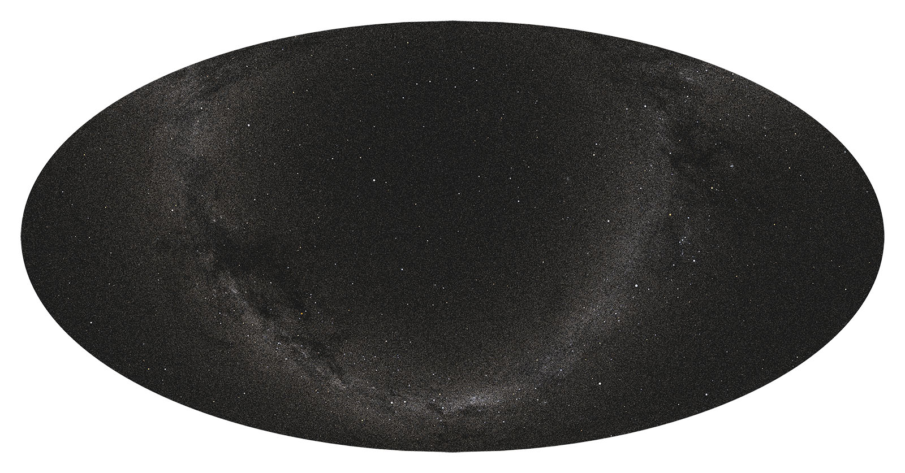

#  Big Sky Catalog

The Big Sky Catalog is a compilation of various Star and Deep Sky Object (DSO) catalogs, tailored for the purpose of visual observation of our beautiful night sky. Currently, it includes the following objects:

|   | Count  | Sources | Details |
|---|---|----|--|
| **Stars** | 2,557,499  | Hipparcos, Tycho-1, Tycho-2 | [details](docs/stars.md) |

\*_The image above was created with [Starplot](https://github.com/steveberardi/starplot), by plotting the brightest 981,852 stars from the Big Sky Catalog._

## Roadmap
Future versions will include objects from these catalogs:

- Messier
- New General Catalogue (NGC)
- Index Catalogue (IC)
- Washington Double Star Catalog (WDS)
- Gaia DR3

It's still very much a work in progress! Help is wanted and appreciated :)

## Data Sources
| Name  | Source  |
|---|---|
| Tycho-2 | [ESA](https://www.cosmos.esa.int/web/hipparcos/tycho-2), [VizieR](https://cdsarc.cds.unistra.fr/viz-bin/cat/I/259#/article)   |
| Washington Double Star Catalog (WDS) | [WDS](http://www.astro.gsu.edu/wds/)  |
| New General Catalogue (NGC) | [OpenNGC](https://github.com/mattiaverga/OpenNGC)  |
| Index Catalogue (IC) | [OpenNGC](https://github.com/mattiaverga/OpenNGC)  |
| Messier | [OpenNGC](https://github.com/mattiaverga/OpenNGC)   |

## Related Projects
- [Starplot](https://github.com/steveberardi/starplot)
- [Sky Atlas](https://skyatlas.app)

## License
[MIT](https://github.com/steveberardi/bigsky/blob/main/LICENSE)
